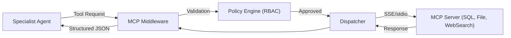

# MCP: Model Context Protocol as Middleware

In the AOS architecture, MCP (Model Context Protocol) is not just a tool standard but a **Middleware Layer**. It acts as the "Standard Interface" (POSIX) between disparate Agentic Models and external capabilities.

## Core Middleware Roles

1. **Protocol Translation**: Translates model-specific `tool_use` (Anthropic), `functions` (OpenAI), or `calls` (Google) into a unified MCP request.
2. **Interception & Policy**: 
    - **Validation**: Ensures tool arguments meet schema before hitting the server.
    - **Audit**: Log every tool call, latency, and response for observability.
    - **Gatekeeping**: RBAC/Security checks (e.g., "Can Agent X call `run_command`?").
3. **Connectivity Hub**: Manages a registry of local (IPC) and remote (SSE) MCP servers.

## Architectural Flow



## Senior Implementation Guide

### 1. Tool Normalization
Always return tool outputs in a standardized JSON envelope:
```json
{
  "tool": "search_database",
  "call_id": "call_99_beta",
  "status": "success | error",
  "data": { ... },
  "metadata": { "latency": "150ms", "agent_id": "auditor_1" }
}
```

### 2. The Loop Prevention Middleware
Intercept duplicate tool calls within the same context window to prevent the "Double-Spend" hallucination.

### 3. Dynamic Discovery
Use the `mcp_list_tools` endpoint to populate the `SKILL.md` layer dynamically, ensuring the Agent's capability set is always in sync with available infrastructure.
