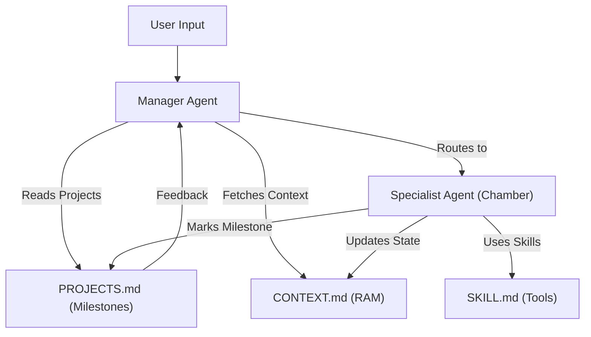

# MAS & MoE Elite Architecture Framework

## 1. Multi-Agent Systems (MAS) Fundamentals
MAS involves multiple independent agents working together to solve complex problems.
- **Manager Agents**: High-level orchestrators.
- **Specialist Agents**: Performance-focused on specific sub-tasks.
- **Critic Agents**: Verification and validation.

## 2. Mixture of Experts (MoE) in Prompting
MoE translates to routing a query to the *best* specific expert model or prompt.
- **Router**: Analyzes intent and complexity.
- **Experts**: Specialized prompts for Code, Finance, Logic, etc.
- **Aggregator**: Synthesizes final results.

## 3. The 4-Layer Memory System (AOS)
The **Agêntic Operating System (AOS)** architecture solves "AI Fragmentation" using a unified context and reasoning layer:

1.  **Identity Layer (`AGENTS.md`)**: Global persistent rules, missions, and expert personalities. (Static)
2.  **Capability Layer (`SKILL.md`)**: Tool definitions, MCP configurations, and "Agent Muscles". (Static/Expanding)
3.  **Context Layer (`CONTEXT.md`)**: The system's **RAM**. Manages session state, real-time hand-offs, and loop prevention. (Dynamic)
4.  **Strategic Layer (`PROJECTS.md`)**: The system's **LTM/Hard Drive**. Tracks milestones, task decomposition, and cross-session goals. (Persistent)

### MAS Pipeline Flow

## 4. Communication & Governance
- **Semantic Handover**: Explicitly passing state and intent between agents via `CONTEXT.md`.
- **Structured Feedback**: JSON-based communication for machine-to-machine clarity.
- **Autonomy Levels**: From "Human-in-the-loop" (HITL) to "Full Autonomous".
